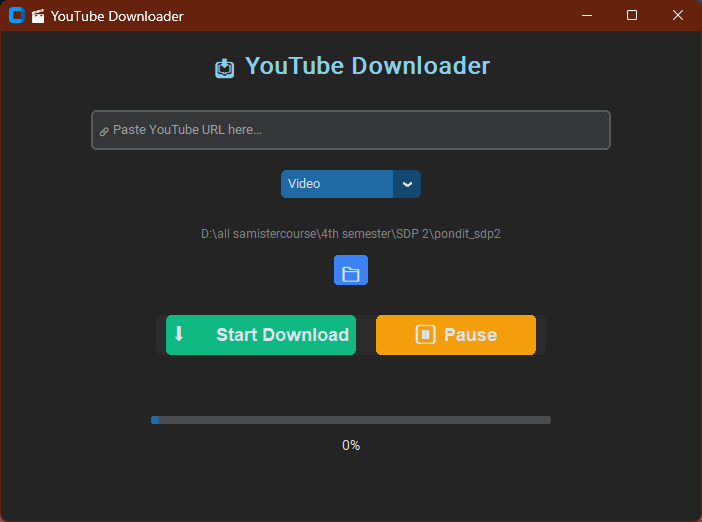

# 🎬 YouTube Downloader (GUI) using CustomTkinter & yt-dlp

<p align="center">
  
  
  
</p>


A modern, simple, and fully functional YouTube Downloader built with [CustomTkinter](https://github.com/TomSchimansky/CustomTkinter) and [yt-dlp](https://github.com/yt-dlp/yt-dlp). This GUI application allows you to download YouTube videos or extract audio with a stylish interface, progress tracking, pause/resume support, and customizable download directory.

---

## ✨ Features

- 🎥 Download **Video** or **Audio**
- 📂 Choose custom **download folder**
- ⏸️ **Pause** / ▶️ **Resume** support
- 📊 Real-time **progress bar**, % display & status
- ✅ Automatic **format merging** (MP4)
- 🧠 Clean, modern **CustomTkinter UI**

---

## 🛠️ Requirements

- Python 3.8+
- `yt-dlp`
- `customtkinter`
- `tkinter` (default with Python)

Install dependencies using:

```bash
pip install -r requirements.txt
```

Or individually:

```bash
pip install yt-dlp customtkinter
```

---

## 🚀 How to Run

1. Clone or download this repository.
2. Navigate to the project directory.
3. Run the main script:

```bash
python main.py
```

---

## 📂 Folder Structure

```
.
├── main.py            # Main application script
├── README.md          # Project documentation
└── requirements.txt   # List of dependencies
```

---

## 🖥️ UI Overview

- **URL Input**: Paste any YouTube link
- **Mode Option**: Choose between `Video` or `Audio`
- **Folder Picker**: Set your preferred download directory
- **Progress Bar**: Visual feedback on download status
- **Control Buttons**:
  - `⬇️ Start Download`: Begin download in a new thread
  - `⏸ Pause` / `▶️ Resume`: Control download flow
<br><br>
---

## 📸 Screenshots

<div style="text-align: center;">
  
</div>

---

## 🧠 Notes

- Downloads are saved using the format: `VideoTitle.mp4` or `.m4a`
- Only single videos are supported (no playlists)
- If a file exists and download was incomplete, it will **resume**
- Pausing uses an intentional `DownloadError` to safely stop `yt-dlp`

---

## 📄 License

This project is licensed under the MIT License. See [LICENSE](LICENSE) for details.

---

## 🙌 Acknowledgements

- [yt-dlp](https://github.com/yt-dlp/yt-dlp) – Advanced video downloader
- [CustomTkinter](https://github.com/TomSchimansky/CustomTkinter) – Modern GUI library for Python
- Icons via Emoji for better UI readability

---

## 💡 Future Improvements (Suggestions)

- Playlist download support
- Video quality selector
- Dark/light mode toggle
- Download history log

---

## 🔗 Connect

If you liked this project or need support, feel free to ⭐ the repo and contribute!